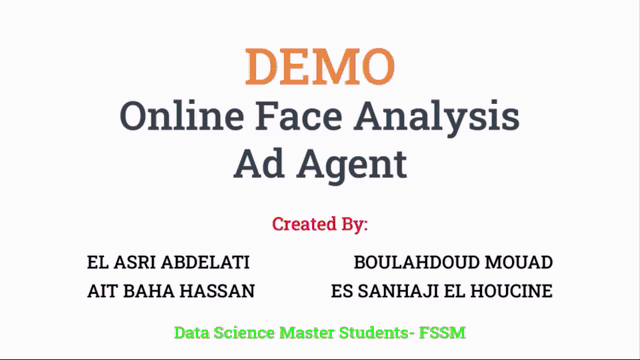

# Online face analysis for digital signage

<br>

## Summary

The project is an ad agent that analyses people's faces and predicts their age and gender to show custom ads, the agent is powered by face detection, age & gender prediction algorithms and connected to a SQL database of ads.


## Dataset 
The dataset used in this project is the “IMDB-WIKI” consists of 500000 images, it is the largest publicly available dataset of face images with gender and age labels for training. We provide pre-trained models for both age and gender prediction.


## Model Architecture
The model that was used to perform this task of age and gender detection is [Wide ResNet](https://arxiv.org/abs/1605.07146).


## Dependencies
- Python 3.7 64bit
- Windows 10 64 bit / version 1909
- Fask web server
- MYSQL server 5.*


## Recommended
Note that is better to create a new virtual environment and install requirements in it to isolate your project from your default environment and to avoid all problems that caused by version conflict.
- The first think is to install ``virtualenv``.
- ``` 
  virtualenv==20.0.21
  ```
- Clone the project
- ```
    cd\Online-Face-Analysis-Ad-Agent
  ```
  Now the folder venv is you main environment and you can name it what are every you want. and all the packages you will install it will store there.
- ```
    virtualenv \venv
  ```
    To activate your virtual environment.
- ```
    venv\Scripts\activate.bat
  ```
  Now you can install any python packages you want in the command line that you are activating the virtual environment and they will be isolated.
  <br>
  To exit the virtual environment. 
- ```
    deactivate
  ```
  For more information check [her](https://www.datacamp.com/community/tutorials/virtual-environment-in-python).


## Requirements
- Get the package from PyPi.
- All requirements that you will need with its version it's exist in `requirements.txt` so you need just to run this    command to install it all :
   ```
   !pip install -r requirements.txt
   ```


## Ads database
We use the mysql database to store the ads informations.
create an databese named `ads_agent` and run the script [database.sql](/database.sql).
<br>
Note that the database login informations is :
- ``host='localhost'``
- ``database='ads_agent'``
- ``user='root'``
- ``password=''``
<br>
Note that you have to install ``mysql-connector`` you can download it [her](https://dev.mysql.com/downloads/connector/python/).


## How to run it
In order to run the demo first you have the download our pretrained ``weights`` [her](https://drive.google.com/drive/folders/1F3FUxlpobEYTzTgn4S6Z2mpCwUQWUsZq) and put it in the folder ``./pretrained_weights``.
<br>
When you install all requirements and you make you environment ready run the [``main.py``](/main.py) and check the [http://localhost:5000/](http://127.0.0.1:5000/).


## Demo
Congratulation.
<br>
The video above shown the demonstration :
<br>
<center>
  
</center>


## Authors
* [Abdelati Elasri](https://github.com/iElasri)
* [Mouad Boulahdoud](https://github.com/MouadBH)
* [Hassn Ait Baha](https://github.com/hassanoxd)
* [El Houcine ES SANHAJI](https://github.com/essanhaji)

<br>

## Thank you.
